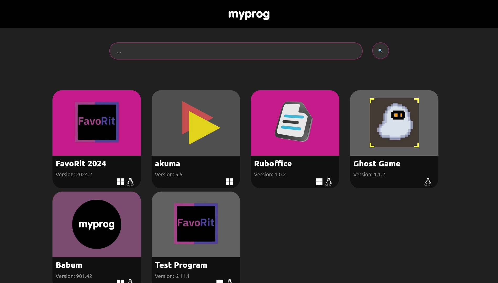

# myprog


# Content
- [About the project](#About-the-project)
- [Install and Launch](#Install-and-Launch)
- [Information on creator](#Information-on-creator)

# About the project
MyProg is an open platform for publishing free open source applications. The purpose of this platform is to support open source projects and promote them.

# Install and Launch
To try the site on your local host, run the following commands:
``` bash
# Clone the repository
git clone https://github.com/filcherock/myprog-django.git

# Go to the repository directory
cd myprog-django

# Installing dependencies
pip install -r requirements.txt
```
<div align="center">
  <table>
    <tr>
      <td align="center">
        
      </td>
      <td align="center">
        
      </td>
    </tr>
    <tr>
      <td align="center">
        
      </td>
    </tr>
  </table>
</div>

